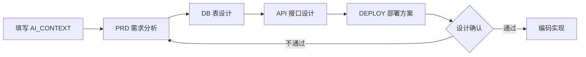

# AI 项目初始化模板

一个面向 **Java 17 + SpringBoot 3** 的项目初始化模板，内置 AI 协作规范与标准文档骨架，帮助你以「先分析、再设计、最后编码」的方式快速启动新项目。

## 模板包含什么

| 文件 / 目录 | 作用 |
|------|------|
| `.cursorrules` | AI 角色定位与编码规范（架构分层、SOLID、返回规范等） |
| `AI_CONTEXT.md` | 项目说明书：项目名称、技术栈、模块、核心流程，AI 介入前必读 |
| `docs/README.md` | 文档总索引 |
| `docs/PRD/` | 产品需求文档模板 |
| `docs/API/` | 接口设计文档模板 |
| `docs/DB/` | 数据库设计文档模板 |
| `docs/DEPLOY/` | 部署文档模板 |
| `server/` | 后端工程：SpringBoot3 + Maven 初始项目，开箱即跑 |
| `.gitignore` | 常用忽略规则（含 `.env`、`target`、`logs` 等） |

## 后端工程（server/）

- 默认启用 `web` + `validation` + `actuator`，自带统一返回 `Result<T>` / `PageResult<T>` 与全局异常处理。
- 配置集中在 `server/.env`（账号密码、各类 Key），yml 通过 `${KEY}` 引用，三环境 `local`/`test`/`prod`，默认 `local`。
  - 注意：`.env` 中含 `#` 等特殊字符的值必须用**双引号**包裹（单引号不会被剥离）。
- 已接入并验证：**MySQL / PostgreSQL（可切换的单数据源）、MongoDB、Redis、RabbitMQ**；其健康状态统一在 `GET /actuator/health` 查看。
- OSS / 火山方舟大模型 / 短信 在 `pom.xml` 与配置中仍为注释，用到时取消注释并在 `.env` 填值即可。
- 启动：`cd server && mvn spring-boot:run`，验证接口 `GET /api/v1/hello`、`GET /api/v1/health`、`GET /actuator/health`。

### 代码分层

遵循 `.cursorrules` 的职责划分：Controller 只做参数接收/校验，业务逻辑在 Service，数据访问在 Repository。

```
com.example.template
├── TemplateApplication.java        # 启动类
├── common/                         # 通用：Result / PageResult / ResultCode / 异常 / 全局异常处理
├── config/                         # 配置类（按需）
├── controller/                     # 控制层：HelloController
├── service/                        # 业务层接口：HelloService
│   └── impl/                       # 业务层实现：HelloServiceImpl（@Service）
└── repository/                     # 数据访问层（按需新增）
```

新增模块时按 `Controller → Service(接口) → ServiceImpl(实现) → Repository` 分层落地。

## 如何基于本模板初始化新项目

1. **克隆 / 复制本模板**，重命名为你的项目目录，并重置 git 历史。
2. **填写 `AI_CONTEXT.md`**：项目名称、简介、技术栈、模块、核心业务流程。
3. **按业务模块补全 `docs/`**：
   - `PRD` → 需求分析
   - `DB` → 表设计
   - `API` → 接口设计
   - `DEPLOY` → 部署方案
4. **确认设计后再进入编码**（遵循 `.cursorrules` 的协作流程）。

## 初始化新项目时需要改的名字

模板里的 `TemplateApplication` / `com.example.template` 等只是占位标识，新项目请按下表统一替换（以示例项目 `game-online` 为例）。改包名建议用 IDE 的 `Refactor → Rename`，会自动同步所有引用：

| 位置 | 模板默认 | 改成（示例） |
|------|----------|--------------|
| 启动类 | `TemplateApplication` | `GameOnlineApplication` |
| 包名 + 目录 | `com.example.template` | `com.yourcompany.gameonline` |
| `pom.xml` `groupId` | `com.example` | `com.yourcompany` |
| `pom.xml` `artifactId` | `template-server` | `game-online-server` |
| `pom.xml` `name` / `description` | template-server | 你的项目名 |
| `.env` / `.env.example` `APP_NAME` | `template-server` | `game-online-server` |
| `application.yml` 日志包名 `logging.level.com.example.template` | 旧包 | 新包 |

> 说明：启动类改名只需同步 `main` 里的 `SpringApplication.run(XxxApplication.class, args)`；类名不影响组件扫描——`@SpringBootApplication` 扫描的是启动类所在包及其子包，只要业务代码在该包下即可。

## 协作流程



新增模块时，AI 会先输出：需求分析 → 模块设计 → 表设计 → API 设计 → 风险分析，**确认后再编码**。

## 技术栈

- 后端：Java 17 / SpringBoot 3 / SpringCloud（可选）
- 存储：MySQL / MongoDB（可选） / Redis
- 消息：RabbitMQ（可选）
- 返回规范：`Result<T>` / `PageResult<T>`

> 占位说明：模板中所有「待填写」「<...>」均为占位符，正式使用时请替换或删除。
