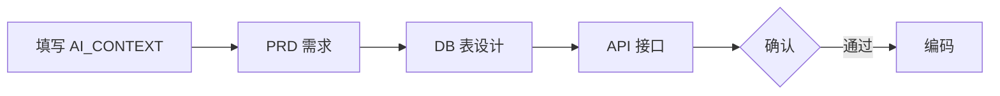

# AI 项目初始化模板

面向 **Java 17 + Spring Boot 3 + React 后台** 的可复用项目模板，内置鉴权/RBAC、系统配置、文件上传、通用 Admin 前端与 AI 协作规范。

> **当前能力快照**：[`docs/TEMPLATE.md`](docs/TEMPLATE.md)

## 模板包含什么

| 文件 / 目录 | 作用 |
|------|------|
| `.cursorrules` | AI 编码规范（分层、日志、鉴权、Swagger） |
| `AI_CONTEXT.md` | 新项目说明书（fork 后首先填写） |
| `docs/TEMPLATE.md` | 模板当前已落地能力总览 |
| `docs/DB/SCHEMA.md` | 数据库表结构与种子数据说明 |
| `docs/DB/template-full.sql` | 全量建表 + 种子 SQL |
| `server/` | Spring Boot 后端（auth / config / file） |
| `web/admin/` | React + Ant Design 通用后台 |
| `.gitignore` | 常用忽略规则 |

## 快速启动

### 后端

```bash
cd server
cp .env.example .env   # 配置 PostgreSQL、JWT_SECRET、Redis 等
mvn spring-boot:run    # Flyway 自动建表 V1~V8
```

- Swagger：http://localhost:8080/swagger-ui.html
- 默认管理员：`admin` / `123456`

### 前端

```bash
cd web/admin
npm install
npm run dev            # 自动加载 .env.development
npm run build          # 自动加载 .env.production
```

## 后端能力概览

- **auth-core**：JWT 双令牌、Redis 黑名单、RBAC、动态菜单、用户管理
- **config-core**：系统键值配置（站点名、Logo 等）
- **file-core**：本地 / 阿里云 OSS 上传，公开/私有访问
- **日志**：traceId 链路、可选 Mongo 集中式审计

详见 [`server/README.md`](server/README.md)。

## 如何 fork 新项目

1. 复制仓库，重置 git，填写 [`AI_CONTEXT.md`](AI_CONTEXT.md)
2. 全局替换包名/项目名（见下表）
3. 修改 `server/.env`（各环境一份）；前端改 `.env.development` / `.env.production` 或 `.env.local`
4. 启动验证后，按业务增量扩展菜单/权限/页面

| 位置 | 模板默认 | 改成（示例） |
|------|----------|--------------|
| 包名 | `com.example.template` | `com.yourcompany.myapp` |
| artifactId | `template-server` | `myapp-server` |
| 启动类 | `TemplateApplication` | `MyappApplication` |

## 协作流程



新增模块时遵循 `.cursorrules`：需求 → 设计 → 确认 → 编码。

## 文档索引

| 文档 | 说明 |
|------|------|
| [docs/README.md](docs/README.md) | 文档中心 |
| [docs/TEMPLATE.md](docs/TEMPLATE.md) | 模板能力快照 |
| [docs/DB/SCHEMA.md](docs/DB/SCHEMA.md) | 表结构 + 种子 |
| [docs/API/auth-v2.0-rbac.md](docs/API/auth-v2.0-rbac.md) | RBAC 接口契约 |
| [web/admin/README.md](web/admin/README.md) | 前端说明 |

## 技术栈

- 后端：Java 17 / Spring Boot 3 / PostgreSQL / Redis / MongoDB（可选）
- 前端：React 18 / TypeScript / Vite / Ant Design 5
- 返回规范：`Result<T>` / `PageResult<T>`
