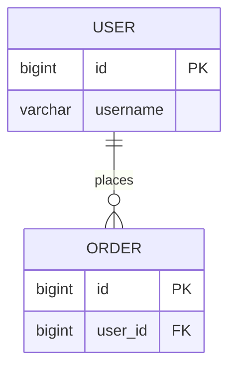

# DB 数据库设计文档

> 用途：记录数据库选型、表结构、索引与 ER 关系，作为编码前的表设计依据。

## 1. 存储选型

| 存储 | 用途 | 说明 |
|------|------|------|
| MySQL | 核心业务数据 | `<事务型数据>` |
| MongoDB | 非结构化 / 日志 | `<如行为日志、文档>` |
| Redis | 缓存 / 分布式锁 | `<缓存 key 规范见下>` |

## 2. 设计规范

- 表名：小写下划线，统一前缀，如 `t_user`
- 主键：`id` BIGINT 自增 或 雪花 ID
- 公共字段：`created_at` / `updated_at` / `is_deleted`（逻辑删除）
- 字符集：`utf8mb4`
- 禁止：物理外键（用应用层维护关系）

## 3. ER 图



## 4. 表结构（按此模板逐表填写）

### 表：`t_<table_name>`

> 说明：`<这张表存什么>`

| 字段 | 类型 | 允许空 | 默认值 | 说明 |
|------|------|--------|--------|------|
| id | BIGINT | 否 | - | 主键 |
| `<field>` | VARCHAR(64) | 否 | '' | `<说明>` |
| created_at | DATETIME | 否 | CURRENT_TIMESTAMP | 创建时间 |
| updated_at | DATETIME | 否 | CURRENT_TIMESTAMP | 更新时间 |
| is_deleted | TINYINT | 否 | 0 | 逻辑删除 0/1 |

**索引**

| 索引名 | 类型 | 字段 | 说明 |
|--------|------|------|------|
| PRIMARY | 主键 | id | - |
| `idx_<field>` | 普通 | `<field>` | `<查询场景>` |

**建表 DDL（示例）**

```sql
CREATE TABLE `t_<table_name>` (
  `id` BIGINT NOT NULL AUTO_INCREMENT,
  `<field>` VARCHAR(64) NOT NULL DEFAULT '' COMMENT '<说明>',
  `created_at` DATETIME NOT NULL DEFAULT CURRENT_TIMESTAMP,
  `updated_at` DATETIME NOT NULL DEFAULT CURRENT_TIMESTAMP ON UPDATE CURRENT_TIMESTAMP,
  `is_deleted` TINYINT NOT NULL DEFAULT 0,
  PRIMARY KEY (`id`),
  KEY `idx_<field>` (`<field>`)
) ENGINE=InnoDB DEFAULT CHARSET=utf8mb4 COMMENT='<表说明>';
```

## 5. Redis Key 规范

| 业务 | Key 模式 | 类型 | TTL | 说明 |
|------|----------|------|-----|------|
| `<业务>` | `<project>:<module>:<key>` | String | `<如 1800s>` | `<说明>` |
