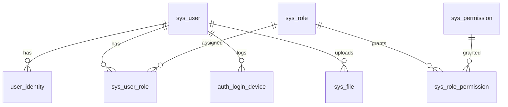

# 数据库表结构与种子数据

> 数据库：**PostgreSQL 12+**（项目默认数据源）  
> 全量 SQL：[`template-full.sql`](./template-full.sql)（与 Flyway `V1~V8` 合并等价，幂等可重复执行）  
> 迁移说明：[`MIGRATIONS.md`](./MIGRATIONS.md)

---

## 1. ER 关系概览



---

## 2. 表清单

| 表名 | 说明 | 引入版本 |
|------|------|----------|
| `sys_user` | 用户主体（ADMIN/MEMBER） | V1 |
| `user_identity` | 登录身份（用户名/手机/邮箱/微信） | V1 |
| `sys_role` | 角色定义 | V1 |
| `sys_user_role` | 用户-角色多对多 | V1 |
| `auth_login_device` | 登录设备/IP/UA 记录 | V1 |
| `sys_permission` | 统一权限（菜单/按钮/API/数据） | V1 |
| `sys_role_permission` | 角色-权限多对多 | V1 |
| `sys_config` | 系统键值配置 | V5 |
| `sys_file` | 文件元数据 | V8 |

---

## 3. 表结构详情

### 3.1 sys_user — 用户主体

| 字段 | 类型 | 说明 |
|------|------|------|
| id | bigserial PK | 主键 |
| user_type | varchar(32) | `ADMIN` / `MEMBER` |
| nickname | varchar(64) | 昵称 |
| avatar_url | varchar(512) | 头像 URL |
| phone / email | varchar | 联系方式 |
| status | varchar(32) | `NORMAL` / `DISABLED` / `DELETED` |
| token_version | int | 自增即作废该用户全部 JWT |
| password_updated_at | timestamp | 密码最后修改时间 |
| last_login_time | timestamp | 最后登录 |
| created_at / updated_at | timestamp | 审计时间 |
| deleted | smallint | 逻辑删除 0/1 |

索引：`idx_user_type`、`idx_phone`、`idx_status`

### 3.2 user_identity — 登录身份

| 字段 | 类型 | 说明 |
|------|------|------|
| user_id | bigint | 关联 sys_user.id |
| identity_type | varchar(32) | `USERNAME` / `PHONE` / `EMAIL` / `WECHAT_MINIAPP` |
| identifier | varchar(128) | 用户名 / 手机号 / openid 等 |
| credential | varchar(255) | BCrypt 密码（微信为空） |
| app_id / union_id | varchar | 微信专用 |

唯一索引：`uk_identity (identity_type, identifier, COALESCE(app_id,''))`

### 3.3 sys_role / sys_user_role

**sys_role**

| 字段 | 说明 |
|------|------|
| role_code | 唯一编码：`ADMIN`、`SUPER_ADMIN`、`OPERATOR` 等 |
| role_name | 展示名 |
| status | `NORMAL` |

**sys_user_role**：`(user_id, role_id)` 唯一（`deleted=0` 条件索引，V2 修复软删后可复插）

### 3.4 auth_login_device — 登录设备

记录 user_id、identity_type、device_id、platform、ip、user_agent、last_login_time。

### 3.5 sys_permission — 统一权限

| 字段 | 说明 |
|------|------|
| permission_code | 全局唯一编码 |
| permission_type | `MENU` / `BUTTON` / `API` / `DATA` |
| parent_id | 菜单父节点（树形） |
| route_path / route_name / component_path | 前端路由元数据 |
| icon / redirect / clickable / breadcrumb / visible / sort_no | 菜单展示 |
| data_scope_code | 数据权限预留 |

MENU 类型供 `GET /api/v1/auth/menus` 返回；API/BUTTON 供 `@PreAuthorize` 与前端按钮显隐。

### 3.6 sys_role_permission

`(role_id, permission_id)` 唯一（`deleted=0`）。SUPER_ADMIN 在代码层短路，无需逐条绑定。

### 3.7 sys_config — 系统配置

| 字段 | 说明 |
|------|------|
| config_key | 全局唯一键 |
| config_name | 展示名 |
| config_value | 值（text） |
| config_group | 分组：`site` / `auth` / `system` |
| value_type | `STRING` / `NUMBER` / `BOOLEAN` / `JSON` |
| editable | 是否可在后台编辑 |
| sort_no | 组内排序 |

### 3.8 sys_file — 文件元数据

| 字段 | 说明 |
|------|------|
| file_key | 对外 UUID 标识 |
| original_name | 原始文件名 |
| storage_type | `local` / `oss` |
| storage_path | 本地相对路径或 OSS object key |
| content_type / file_size / file_hash | 文件属性 |
| biz_type | `avatar` / `image` / `document` / `attachment` |
| access_level | `public` / `private` |
| uploader_id / uploader_type | 上传者 |
| status | `NORMAL` |

---

## 4. 种子数据

### 4.1 初始管理员（V1）

| 项 | 值 |
|----|-----|
| 用户名 | `admin` |
| 密码 | `123456`（BCrypt 密文写入 user_identity.credential） |
| 角色 | `ADMIN` + `SUPER_ADMIN` |
| user_type | `ADMIN` |

BCrypt 密文（仅供核对）：

```
$2a$10$80q/EroxaxNvlS7kNBg9Bel8P3iyMHSx8TEJ9KemE.ofg0ZIaSOvS
```

生产环境生成新密文：

```java
new org.springframework.security.crypto.bcrypt.BCryptPasswordEncoder().encode("你的新密码");
```

### 4.2 预置角色（V1）

| role_code | role_name | 说明 |
|-----------|-----------|------|
| ADMIN | 管理员 | 种子授予全部业务权限 |
| SUPER_ADMIN | 超级管理员 | 代码短路全部权限码 |

### 4.3 API 权限码（汇总）

| permission_code | 名称 | 版本 |
|-----------------|------|------|
| auth:user:read | 查看用户 | V1 |
| auth:user:create | 新建用户 | V1/V2 |
| auth:user:update | 编辑用户 | V1/V2 |
| auth:user:reset_password | 重置密码 | V1/V2 |
| auth:user:disable | 禁用用户 | V1 |
| auth:user:force_logout | 强制下线 | V1 |
| auth:user:grant_role | 分配用户角色 | V1 |
| auth:permission:read | 查看权限 | V1 |
| auth:role:read | 查看角色权限 | V1 |
| auth:role:grant_permission | 配置角色权限 | V1 |
| auth:role:create | 新建角色 | V5 |
| auth:rbac:ping | RBAC 探活 | V1 |
| auth:audit:read | 查看审计日志 | V4 |
| auth:config:read | 查看系统配置 | V5 |
| auth:config:update | 更新系统配置 | V5 |
| auth:config:create | 新建系统配置 | V6 |
| auth:config:delete | 删除系统配置 | V7 |
| file:upload | 上传文件 | V8 |
| file:read | 查看文件 | V8 |
| file:delete | 删除文件 | V8 |
| file:admin | 管理全部文件 | V8（仅 SUPER_ADMIN 种子绑定） |

### 4.4 菜单权限码（MENU）

| permission_code | 标题 | path | component |
|-----------------|------|------|-----------|
| menu:system:root | 系统管理（目录） | /system | — |
| menu:auth:user | 用户管理 | /system/user | /pages/auth/user/index |
| menu:auth:role | 角色权限 | /system/role | /pages/auth/role/index |
| menu:system:audit | 审计日志 | /system/audit | /pages/system/audit/index |
| menu:system:config | 系统配置 | /system/config | /pages/system/config/index |

Dashboard 等页面由前端静态路由注册，不依赖 MENU 种子。

### 4.5 角色-权限绑定规则

- **SUPER_ADMIN**：代码层 `PermissionChecker` 短路，种子仅绑定用户关系
- **ADMIN**：种子授予上述全部 API + MENU（除 `file:admin` 仅 SUPER_ADMIN）
- 变更角色/用户授权时会 `token_version + 1` 使权限即时生效

### 4.6 sys_config 初始项（V5）

| config_key | 默认值 | 分组 | 类型 |
|------------|--------|------|------|
| site.name | 管理后台 | site | STRING |
| site.logo | （空） | site | STRING |
| site.copyright | © 2026 Template | site | STRING |
| auth.login.captcha_enabled | false | auth | BOOLEAN |
| auth.password.min_length | 8 | auth | NUMBER |
| auth.session.idle_minutes | 120 | auth | NUMBER |
| system.maintenance_mode | false | system | BOOLEAN |
| system.audit.retention_days | 30 | system | NUMBER |

---

## 5. 如何使用 SQL 文件

### 方式一：Flyway 自动迁移（推荐）

```bash
cd server
# 配置 .env 中 POSTGRES_* 后
mvn spring-boot:run
```

脚本目录：`server/src/main/resources/db/migration/V1__auth_core.sql` … `V8__file_core.sql`

### 方式二：手动执行全量 SQL

```bash
psql -h HOST -U USER -d DBNAME -f docs/DB/template-full.sql
```

> 若库中已有表且无 `flyway_schema_history`，请勿重复手动执行后再启 Flyway，见 [`MIGRATIONS.md`](./MIGRATIONS.md)。

---

## 6. 设计约定

- 无物理外键，关系由应用层维护
- 统一逻辑删除字段 `deleted`（0 未删 / 1 已删）
- 唯一索引均带 `WHERE deleted = 0`，支持软删后同码复用
- 时间字段默认 `now()`，应用层更新 `updated_at`
