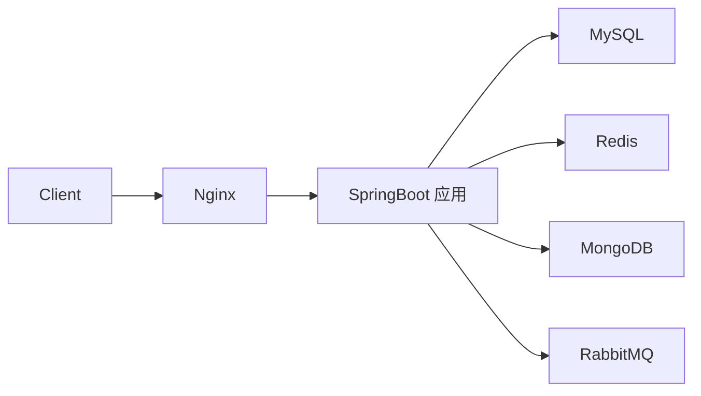

# DEPLOY 部署文档

> 用途：记录部署架构、服务器配置、Nginx 与 Docker 配置，保证可复现部署。

## 1. 部署架构



## 2. 环境信息

| 环境 | 说明 | 域名 / IP |
|------|------|-----------|
| dev | 开发 | `<待填写>` |
| test | 测试 | `<待填写>` |
| prod | 生产 | `<待填写>` |

## 3. 服务器配置

| 项 | 配置 |
|------|------|
| 系统 | `<如 Ubuntu 22.04>` |
| CPU / 内存 | `<如 4C8G>` |
| JDK | Java 17 |
| 中间件 | MySQL / Redis / MongoDB / RabbitMQ |

## 4. 环境变量 / 配置项

> 敏感信息通过环境变量注入，禁止硬编码（参考根目录 `.gitignore` 已忽略 `.env`）。

| 变量 | 说明 | 示例 |
|------|------|------|
| `SPRING_PROFILES_ACTIVE` | 激活环境 | `prod` |
| `MYSQL_URL` | 数据库连接 | `jdbc:mysql://...` |
| `REDIS_HOST` | Redis 地址 | `127.0.0.1` |

## 5. Nginx 配置（示例）

```nginx
server {
    listen 80;
    server_name <your-domain>;

    location /api/ {
        proxy_pass http://127.0.0.1:8080/;
        proxy_set_header Host $host;
        proxy_set_header X-Real-IP $remote_addr;
        proxy_set_header X-Forwarded-For $proxy_add_x_forwarded_for;
    }
}
```

## 6. Docker 部署

### Dockerfile（示例）

```dockerfile
FROM eclipse-temurin:17-jre
WORKDIR /app
COPY target/app.jar app.jar
EXPOSE 8080
ENTRYPOINT ["java", "-jar", "app.jar"]
```

### docker-compose（示例片段）

```yaml
services:
  app:
    build: .
    ports:
      - "8080:8080"
    environment:
      - SPRING_PROFILES_ACTIVE=prod
    depends_on:
      - mysql
      - redis
```

## 7. 部署步骤

1. `<构建：如 mvn clean package -DskipTests>`
2. `<打镜像 / 上传制品>`
3. `<启动：如 docker compose up -d>`
4. `<健康检查：如 GET /actuator/health>`

## 8. 回滚与监控

- 回滚：`<策略，如保留上一个镜像 tag>`
- 监控：`<如日志位置、告警、actuator 指标>`
