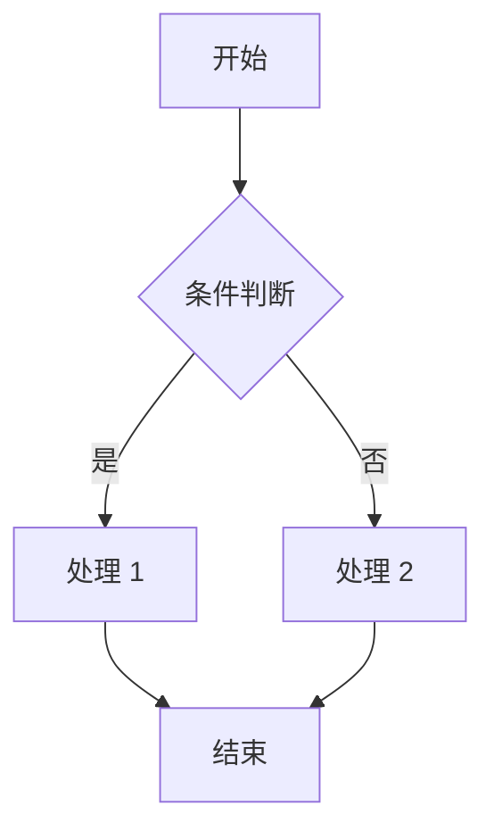

# PRD 产品需求文档

> 用途：记录**新业务模块**的产品需求。模板已内置的鉴权/RBAC/配置/文件能力见 [`../TEMPLATE.md`](../TEMPLATE.md)，无需重复编写 PRD。

## 1. 文档信息

| 项 | 内容 |
|------|------|
| 模块名称 | `<模块名，如 order-center>` |
| 负责人 | `<待填写>` |
| 版本 | v0.1 |
| 更新日期 | `<YYYY-MM-DD>` |

## 2. 需求背景

`<为什么要做这个功能？解决什么问题？>`

## 3. 功能列表

| 编号 | 功能 | 优先级 | 说明 |
|------|------|--------|------|
| F-001 | `<功能名>` | P0 | `<一句话描述>` |

## 4. 业务流程

## 5. 页面原型

`<原型链接 / 截图 / 页面要素>`

## 6. 业务规则与边界

- `<规则与异常场景>`

## 7. 非功能性需求

- 性能 / 安全 / 兼容性

## 8. 待确认问题

- [ ] `<开放问题>`
