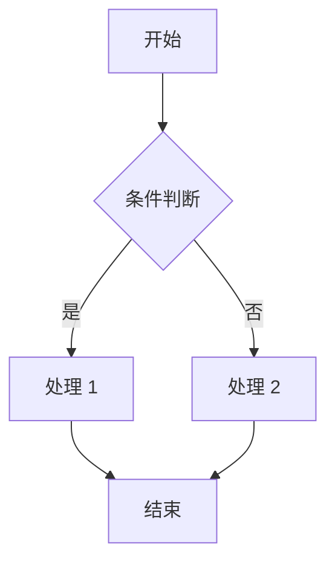

# PRD 产品需求文档

> 用途：记录产品需求、业务流程、页面原型，作为后续接口设计与表设计的输入。

## 1. 文档信息

| 项 | 内容 |
|------|------|
| 模块名称 | `<模块名，如 user-center>` |
| 负责人 | `<待填写>` |
| 版本 | v0.1 |
| 更新日期 | `<YYYY-MM-DD>` |

## 2. 需求背景

`<为什么要做这个功能？解决什么问题？目标用户是谁？>`

## 3. 功能列表

| 编号 | 功能 | 优先级(P0/P1/P2) | 说明 |
|------|------|------------------|------|
| F-001 | `<功能名>` | P0 | `<一句话描述>` |

## 4. 业务流程

> 建议使用流程图描述核心链路。

## 5. 页面原型

`<贴出原型图链接 / 截图，或描述页面要素与交互>`

## 6. 业务规则与边界

- `<规则 1：如校验规则、状态流转、权限约束>`
- `<异常 / 边界场景说明>`

## 7. 非功能性需求

- 性能：`<如 QPS、响应时间>`
- 安全：`<如鉴权、数据脱敏>`
- 兼容：`<如浏览器 / 终端>`

## 8. 待确认问题

- [ ] `<待与产品/业务确认的开放问题>`
